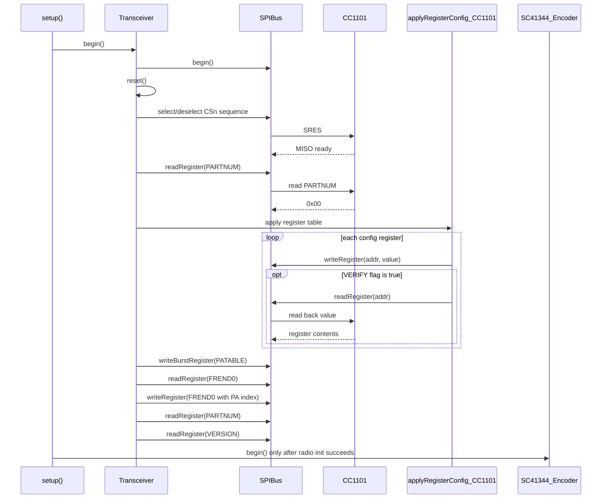

# Runtime Sequence Diagrams

## Startup And Radio Bring-Up



## Confirmed Button Press To RF Transmission

```mermaid
sequenceDiagram
    participant ISR as rawISRbuttonPressed()
    participant Deb as CircularDebounceBuffer
    participant Loop as loop()
    participant Callback as onButtonPressed()
    participant Trx as Transceiver
    participant Streamer as SC41344_FrameStreamer
    participant Enc as SC41344_Encoder
    participant Chip as CC1101

    ISR->>Deb: startDebounce()
    Loop->>Deb: update()
    Deb-->>Callback: confirmed press callback
    Callback->>Trx: transmitFrame(code, encoder)
    loop 4 total frame emissions
        alt repeat frame
            Trx->>Enc: sendSilence()
        end
        Trx->>Trx: enableTransmitMode()
        Trx->>Chip: SIDLE / STX strobes
        Chip-->>Trx: MARCSTATE = TX
        Trx->>Streamer: streamFrameOnceStatic(code, encoder, firstFrame?)
        alt first frame
            Streamer->>Enc: sendPreamble()
        end
        Streamer->>Enc: send bits 0/1
        Streamer->>Enc: sendOpen()
        Enc->>Chip: toggle GDO0 async OOK data input
        Trx->>Chip: SIDLE
    end
    Callback-->>Loop: transmission complete
```
