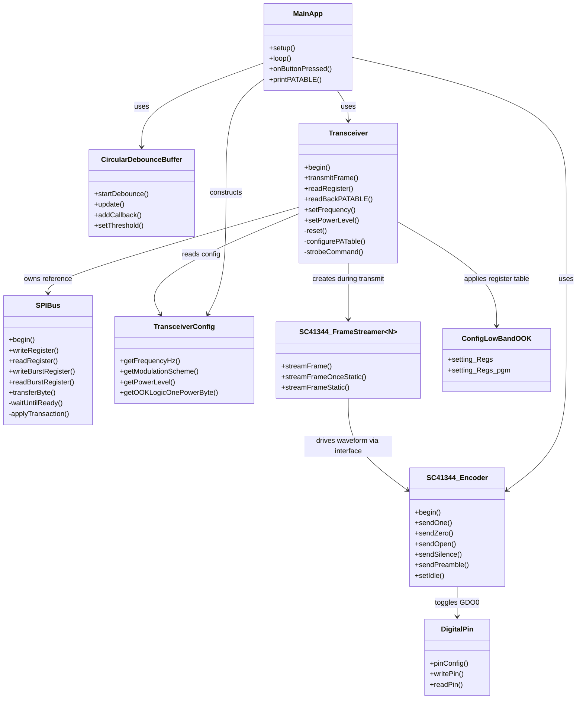

# UML Class Diagram

## Notes

- `MainApp` represents the object graph assembled in `src/main.cpp`.
- `ConfigLowBandOOK` represents the low-band startup register table in `include/Config/CC1101_Config/CC1101_LowBand_OOK_Config.h`.
- The frame streamer and encoder are intentionally separate: one defines frame structure, the other defines pulse timing.
